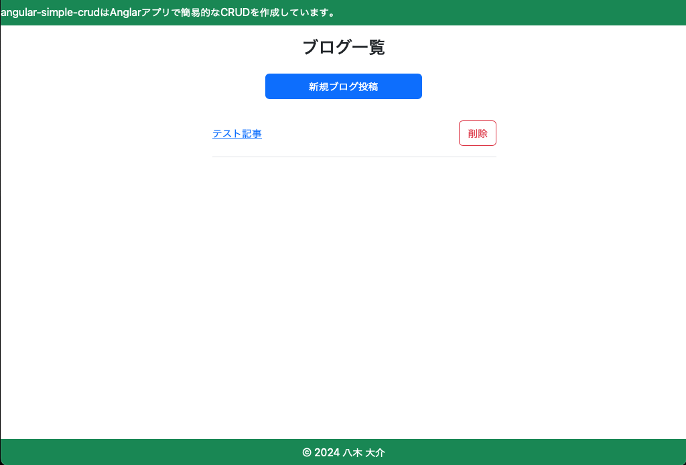
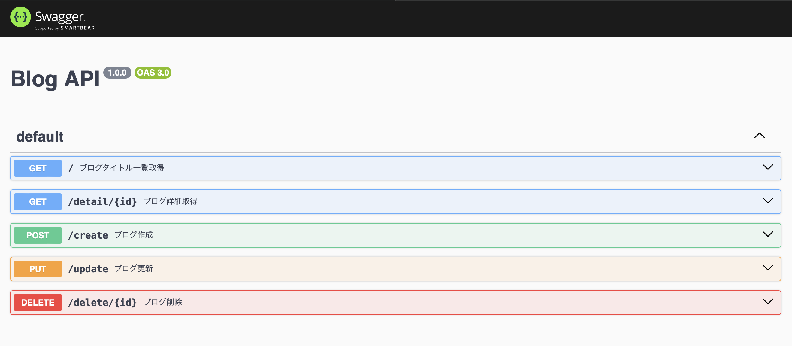

# Angularアプリのサンプル



## 動作確認方法

リポジトリをクローンした後、以下の手順に従って環境を設定してください。

### 1. リポジトリのクローン

まず、以下のコマンドを使用してリポジトリをクローンします。

```bash
git clone https://github.com/yagidaisuke-l/Angular-Simple-CRUD.git
cd Angular-Simple-CRUD
```


### 2. コンテナ起動

```bash
cp .env.local .env
docker-compose up -d --build
```

### 3. 依存関係のインストール

プロジェクトが依存するパッケージをインストールします。

```bash
・MySQL
docker cp mysql/init/init.sql mysql:/usr/local/src/init.sql
docker-compose exec db bash
mysql -u root -proot < /usr/local/src/init.sql

・Angular
docker-compose exec node bash
cd angular-simple-crud
npm install
```

### 4. 開発サーバーの起動

開発サーバーを起動して、アプリケーションが正しく動作することを確認します。

```bash
docker-compose exec node bash
cd angular-simple-crud
ng serve --host 0.0.0.0
http://localhost:4200
```
